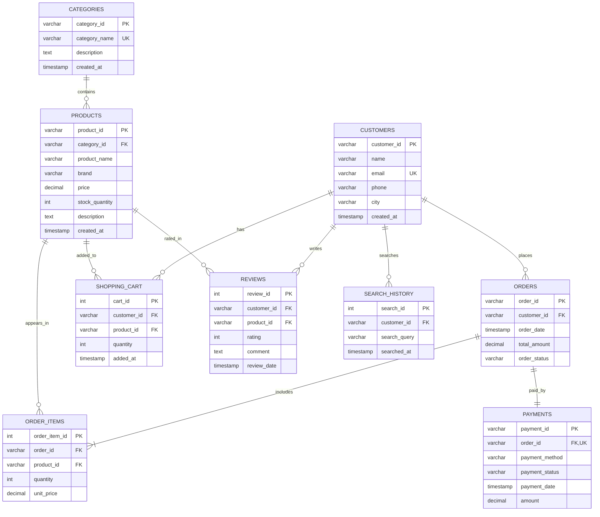

# Entity-Relationship (ER) Diagram & Schema Specification

This document defines the relational database architecture for the **AI-Based E-Commerce Database with Product Recommendation** system.

---

## 1. Visual ER Diagram (Crow's Foot Notation)

---

## 2. Relational Schema Data Dictionary

| Table Name | Attributes | Primary Key | Foreign Keys & Constraints | Description |
| :--- | :--- | :--- | :--- | :--- |
| **`categories`** | `category_id`, `category_name`, `description`, `created_at` | `category_id` | `category_name UNIQUE` | Defines 8 domains (Computing, Mobile, Gaming, Photo, Fitness, Office, Coffee, Study). |
| **`products`** | `product_id`, `category_id`, `product_name`, `brand`, `price`, `stock_quantity`, `description` | `product_id` | `category_id` $\to$ `categories(category_id)`, `price >= 0`, `stock_quantity >= 0` | Master catalog of 45 items with price and live inventory tracking. |
| **`customers`** | `customer_id`, `name`, `email`, `phone`, `city`, `created_at` | `customer_id` | `email UNIQUE` | Customer records; showcase profiles `C101`–`C108` correspond to the 8 domains. |
| **`orders`** | `order_id`, `customer_id`, `order_date`, `total_amount`, `order_status` | `order_id` | `customer_id` $\to$ `customers(customer_id)` ON DELETE CASCADE | Customer orders processed via ACID transactions. |
| **`order_items`** | `order_item_id`, `order_id`, `product_id`, `quantity`, `unit_price` | `order_item_id` | `order_id` $\to$ `orders`, `product_id` $\to$ `products`, `quantity > 0`, `UNIQUE(order_id, product_id)` | Junction bridge decomposing the M:N relationship between Orders and Products. |
| **`payments`** | `payment_id`, `order_id`, `payment_method`, `payment_status`, `payment_date`, `amount` | `payment_id` | `order_id UNIQUE` $\to$ `orders(order_id)` | Atomic transaction payment records. |
| **`shopping_cart`** | `cart_id`, `customer_id`, `product_id`, `quantity`, `added_at` | `cart_id` | `customer_id` $\to$ `customers`, `product_id` $\to$ `products` | Temporary session state used to trigger real-time Apriori antecedent rules. |
| **`reviews`** | `review_id`, `customer_id`, `product_id`, `rating`, `comment`, `review_date` | `review_id` | `customer_id` $\to$ `customers`, `product_id` $\to$ `products`, `rating BETWEEN 1 AND 5` | Customer feedback used for rating aggregations and collaborative filtering. |
| **`search_history`** | `search_id`, `customer_id`, `search_query`, `searched_at` | `search_id` | `customer_id` $\to$ `customers` | Past search queries used for Content-Based Cosine Similarity matching. |

---

## 3. Cardinality Ratios
- **Categories to Products**: $1 : N$ (A category contains many products; a product belongs to one category).
- **Customers to Orders**: $1 : N$ (A customer can place multiple orders; an order belongs to one customer).
- **Orders to Products**: $M : N$ (An order contains many products; a product appears in many orders, resolved via `order_items`).
- **Orders to Payments**: $1 : 1$ (Each order has exactly one payment record).
- **Customers to Shopping Cart**: $1 : N$ (A customer has multiple items in their cart).
- **Customers to Reviews**: $1 : N$ (A customer can leave multiple reviews).
- **Products to Reviews**: $1 : N$ (A product can receive multiple reviews from different customers).
