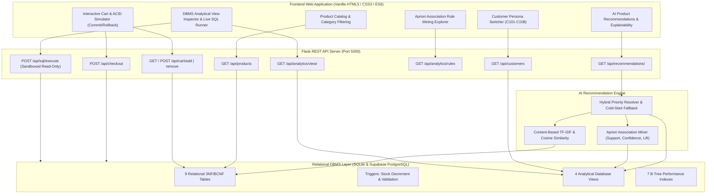
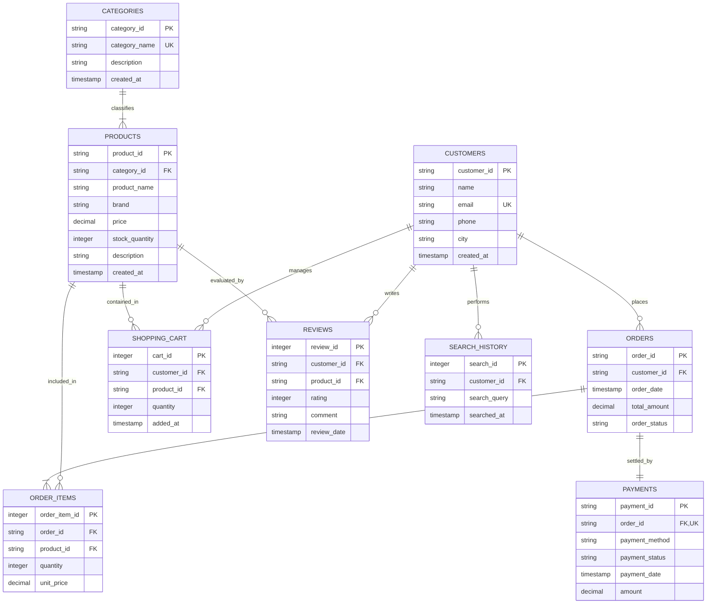

# Phase 1 Baseline Architecture & Technical Verification Report

**Project**: NexusAI / DB-Ecom  
**Phase**: Phase 1 Baseline & Verification  
**Date**: October 2026  
**Status**: Verified Stable Baseline  
**Git Branch**: `phase-1-baseline`

---

## 1. Executive Summary & Purpose

The purpose of **Phase 1** is to establish a rigorous, verified, and stable baseline of the existing **NexusAI** database-first e-commerce system without altering product direction, redesigning UI, introducing external machine learning frameworks, or modifying core database schemas.

All existing components—Relational DBMS schemas, SQL analytical views, database triggers, B-Tree performance indexes, ACID transaction checkout routines, Apriori association rule mining, Content-Based TF-IDF cosine similarity, Flask REST API endpoints, and single-page frontend portal—have been audited, executed, hardened against vulnerabilities, and verified against tests.

---

## 2. System Architecture



---

## 3. Technology Stack

| Layer | Technologies & Libraries | Purpose |
| :--- | :--- | :--- |
| **Frontend** | HTML5, Modern CSS3 (Dark Glassmorphism, CSS Custom Properties), Vanilla JavaScript (ES6+ `async/await`, Fetch API) | Single-page interactive student & examiner demonstration portal |
| **Backend** | Python 3.12+, Flask 3.0+, Flask-CORS 6.0+ | REST API server, transaction orchestrator, static asset server |
| **Database** | SQLite 3 (`database/ecommerce.db`), PostgreSQL 15+ (Supabase Migration Support) | 3NF normalized schema, triggers, views, indexes, ACID engine |
| **AI / Data Mining** | Pure Python implementation (`itertools.combinations`, `math`, `re`) | Apriori association rule mining, TF-IDF vectorization, Cosine Similarity |
| **Database Connectors** | `sqlite3` (Standard Library), `psycopg2-binary` (PostgreSQL/Supabase) | Local connection management and remote cloud synchronization |

---

## 4. Directory Structure

```
DB Project/
├── .env                         # Local environment configuration (git-ignored)
├── .env.example                 # Sanitized configuration template
├── .gitignore                   # Ignores .env, virtual environments, bytecode, logs
├── requirements.txt             # Documented Python runtime dependencies
├── test_db_verification.py      # Automated database, schema, trigger, & view test suite
├── test_ai_verification.py      # Automated Apriori, Content-Based, & Hybrid AI test suite
├── test_api_verification.py     # Automated Flask REST API & security audit test suite
├── test_supabase.py             # Optional live Supabase connection verification
├── README.md                    # Primary project documentation & execution guide
├── database/
│   ├── schema.sql               # DDL: 9 relational tables with constraints & cascades
│   ├── views_triggers.sql       # 4 analytical views, 2 triggers, 7 B-Tree indexes
│   ├── seed_data.py             # Database seed generator (8 domains, 45 products, 25 customers)
│   ├── transactions.py          # Atomic ACID checkout transaction test script
│   ├── ecommerce.db             # Primary SQLite relational database
│   ├── migrate_supabase.py      # Remote PostgreSQL DDL migration runner
│   ├── seed_supabase.py         # Cross-database data sync script (SQLite -> Supabase)
│   └── supabase_migration.sql   # PostgreSQL-compatible DDL schema
├── ai/
│   ├── apriori.py               # Pure-Python Apriori association rule miner
│   ├── content_based.py         # TF-IDF & Cosine Similarity recommender
│   └── recommender.py           # Hybrid recommendation engine
├── backend/
│   └── app.py                   # Flask REST API server & sandboxed SQL runner
├── frontend/
│   ├── index.html               # Single-page UI portal
│   ├── style.css                # Dark-mode design system
│   └── app.js                   # Client-side controller & event handler
└── docs/
    ├── ER_DIAGRAM.md            # Detailed Entity-Relationship documentation
    ├── NORMALIZATION.md         # 1NF, 2NF, 3NF, BCNF normalization proofs
    ├── PHASE1_BASELINE.md       # This baseline architecture & verification report
    └── PHASE1_TEST_REPORT.md    # Phase 1 test execution report
```

---

## 5. Database Schema & Relational Specifications

The schema enforces Third Normal Form (3NF) and Boyce-Codd Normal Form (BCNF) principles across 9 relational tables:



### Table Integrity Constraints & Foreign Key Behaviors:
1. **`categories`**: Primary Key `category_id`, Unique `category_name`.
2. **`products`**: Primary Key `product_id`, Foreign Key `category_id` referencing `categories` (`ON DELETE RESTRICT`), `CHECK (price >= 0)`, `CHECK (stock_quantity >= 0)`.
3. **`customers`**: Primary Key `customer_id`, Unique `email`.
4. **`orders`**: Primary Key `order_id`, Foreign Key `customer_id` referencing `customers` (`ON DELETE CASCADE`), `CHECK (total_amount >= 0)`, `CHECK (order_status IN ('PENDING', 'PROCESSING', 'COMPLETED', 'CANCELLED'))`.
5. **`order_items`**: Primary Key `order_item_id` (Autoincrement), Foreign Key `order_id` referencing `orders` (`ON DELETE CASCADE`), Foreign Key `product_id` referencing `products` (`ON DELETE RESTRICT`), Composite Unique `UNIQUE(order_id, product_id)`, `CHECK (quantity > 0)`, `CHECK (unit_price >= 0)`.
6. **`payments`**: Primary Key `payment_id`, Foreign Key `order_id` referencing `orders` (`ON DELETE CASCADE`, Unique 1:1), `CHECK (payment_method IN (...))`, `CHECK (payment_status IN (...))`, `CHECK (amount >= 0)`.
7. **`shopping_cart`**: Primary Key `cart_id` (Autoincrement), Foreign Keys to `customers` and `products` (`ON DELETE CASCADE`), Composite Unique `UNIQUE(customer_id, product_id)`, `CHECK (quantity > 0)`.
8. **`reviews`**: Primary Key `review_id` (Autoincrement), Foreign Keys to `customers` and `products` (`ON DELETE CASCADE`), Composite Unique `UNIQUE(customer_id, product_id)`, `CHECK (rating BETWEEN 1 AND 5)`.
9. **`search_history`**: Primary Key `search_id` (Autoincrement), Foreign Key to `customers` (`ON DELETE CASCADE`).

---

## 6. Database Views

1. **`v_market_basket`**:
   - **Purpose**: Groups completed order items into single comma-delimited product string representations (`product_ids`, `product_names`, `basket_size`, `order_total`).
   - **Consumer**: Ingested directly by `AprioriMiner` in `ai/apriori.py`.
2. **`v_customer_purchase_summary`**:
   - **Purpose**: Aggregates customer order frequency, distinct products purchased, and lifetime spend per customer.
   - **Consumer**: Displayed in customer switcher, hero cards, and the DBMS view inspector.
3. **`v_product_performance`**:
   - **Purpose**: Calculates units sold, gross revenue, review count, and average customer rating per product across categories.
   - **Consumer**: Powers cold-start top-rated recommendations and catalog analytics.
4. **`v_frequent_product_pairs`**:
   - **Purpose**: Pure SQL self-join query finding 2-item co-occurrence frequencies without external code.
   - **Consumer**: Academic demonstration of relational relational algebra vs AI mining.

---

## 7. Database Triggers

1. **`trg_validate_stock_before_order`**:
   - **Type**: `BEFORE INSERT ON order_items FOR EACH ROW`
   - **Condition**: `WHEN (SELECT stock_quantity FROM products WHERE product_id = NEW.product_id) < NEW.quantity`
   - **Action**: `SELECT RAISE(ABORT, 'Insufficient stock available for this product.');`
   - **Guarantee**: Prevents overselling at the database engine level before any write occurs.
2. **`trg_decrement_product_stock`**:
   - **Type**: `AFTER INSERT ON order_items FOR EACH ROW`
   - **Action**: `UPDATE products SET stock_quantity = stock_quantity - NEW.quantity WHERE product_id = NEW.product_id;`
   - **Guarantee**: Atomically reduces stock concurrently with order item creation.

---

## 8. B-Tree Performance Indexes

The database defines 7 dedicated B-Tree indexes:
1. `idx_products_category` on `products(category_id)`
2. `idx_orders_customer` on `orders(customer_id)`
3. `idx_order_items_product` on `order_items(product_id)`
4. `idx_order_items_order` on `order_items(order_id)`
5. `idx_reviews_product_rating` on `reviews(product_id, rating)`
6. `idx_search_customer` on `search_history(customer_id)`
7. `idx_cart_customer` on `shopping_cart(customer_id)`

---

## 9. ACID Checkout Transaction Lifecycle

Implemented in `database/transactions.py` and exposed via `POST /api/checkout`:

```
BEGIN TRANSACTION;
  │
  ├─► [1] Read items from customer's shopping cart
  │
  ├─► [2] Validate stock availability for each item (Application level)
  │
  ├─► [3] Insert Order header into orders table (Status: 'COMPLETED')
  │
  ├─► [4] Insert Order Items into order_items table
  │       ├─► BEFORE INSERT Trigger validates stock (Aborts if stock < qty)
  │       └─► AFTER INSERT Trigger decrements stock in products table
  │
  ├─► [5] Insert Payment record into payments table
  │
  ├─► [6] If simulated_failure == True:
  │       └─► Raise Exception ──► ROLLBACK TRANSACTION;
  │                                ├─ Stock restored to pre-checkout value
  │                                ├─ Order & items discarded
  │                                ├─ Payment record discarded
  │                                └─ Shopping cart remains intact
  │
  ├─► [7] Delete items from shopping_cart table
  │
  └─► [8] COMMIT TRANSACTION;
          └─ All changes permanently persisted to disk
```

---

## 10. AI Recommendation Engine Pipeline

The AI engine (`ai/recommender.py`) executes a 4-tier prioritized pipeline:

1. **Context Extraction**:
   - Identifies products already purchased by customer (`purchased_pids`).
   - Identifies products currently in customer's cart (`cart_pids`).
   - Identifies recent search query strings from `search_history`.
   - Aggregates known items: `known_pids = purchased_pids | cart_pids`.
   - Sets exclusion list: `seen_pids = set(known_pids)` to ensure no duplicate recommendations.
2. **Tier 1 — Apriori Association Rule Mining**:
   - Scans rules ($X \to Y$) generated from `v_market_basket`.
   - If antecedent $X \subseteq \text{known\_pids}$, candidate products $Y \setminus \text{seen\_pids}$ are scored:
     $$\text{Score} = \text{Confidence}(X \to Y) \times \text{Lift}(X \to Y)$$
   - Top candidates added with statistical explanation (Confidence %, Lift multiple).
3. **Tier 2 — Content-Based Search Intent Matching (TF-IDF & Cosine Similarity)**:
   - If fewer than `top_n` items are found and the customer has recent search queries:
   - Tokenizes query and computes Cosine Similarity against all product TF-IDF document vectors:
     $$\text{CosineSim}(\mathbf{q}, \mathbf{d}) = \frac{\mathbf{q} \cdot \mathbf{d}}{\|\mathbf{q}\| \|\mathbf{d}\|}$$
   - Matching products appended with search rationale.
4. **Tier 3 — DBMS Analytical Top-Rated Fallback**:
   - If still under `top_n` items (e.g. cold-start customer with zero history):
   - Queries `v_product_performance` sorted by `avg_rating DESC, review_count DESC`.
   - Populates remaining slots with top-rated items.

---

## 11. Backend API Endpoint Specifications

| Method | Endpoint | Description | Request Body / Query Params | Response Format |
| :--- | :--- | :--- | :--- | :--- |
| `GET` | `/` | Web application single-page portal | None | `text/html` |
| `GET` | `/api/customers` | List all 25 customers with lifetime summary | None | `{"status": "success", "customers": [...]}` |
| `GET` | `/api/products` | Retrieve catalog products and categories | Optional `?category_id=CAT01` | `{"status": "success", "categories": [...], "products": [...]}` |
| `GET` | `/api/recommendations/<id>` | Personalized recommendations for customer | Optional `?top_n=4` (Validated) | `{"status": "success", "data": {"customer": ..., "history": ..., "recommendations": [...]}}` |
| `GET` | `/api/cart/<customer_id>` | Current shopping cart contents & total | None | `{"status": "success", "items": [...], "total_amount": float}` |
| `POST` | `/api/cart/add` | Add product to customer shopping cart | `{"customer_id": str, "product_id": str, "quantity": int > 0}` | `{"status": "success", "message": str}` |
| `POST` | `/api/cart/remove` | Remove product from customer shopping cart | `{"customer_id": str, "product_id": str}` | `{"status": "success", "message": str}` |
| `POST` | `/api/checkout` | Execute atomic checkout transaction | `{"customer_id": str, "payment_method": str, "simulate_fail": bool}` | `{"status": "success"|"error", "result": {...}}` |
| `GET` | `/api/analytics/rules` | Mined association rules with threshold filters | Optional `?min_confidence=0.5&min_lift=1.2&limit=50` | `{"status": "success", "total_rules": int, "rules": [...]}` |
| `GET` | `/api/analytics/view/<name>` | Query analytical view contents (whitelisted) | Whitelisted view name in URL path | `{"status": "success", "columns": [...], "data": [...]}` |
| `POST` | `/api/sql/execute` | Sandboxed live read-only SQL query runner | `{"query": "SELECT ..."}` | `{"status": "success", "columns": [...], "row_count": int, "rows": [...]}` |

---

## 12. Frontend Feature Set

- **Customer Switcher**: Live dropdown to select across 8 domain personas (`C101` to `C108`) with domain badge and stats.
- **Personalized Recommendations Card Grid**: Visual display of recommended items with AI algorithm badges (Apriori ⚡, Content 🔍, Rating ★), Confidence & Lift metrics, and "Add to Cart" CTA.
- **Product Catalog Explorer**: Interactive category pills for all 8 domains with instant live keyword search filtering.
- **Interactive Shopping Cart Drawer**: Slide-out cart displaying item quantities, unit prices, subtotals, and total order sum.
- **ACID Transaction Simulator Console**:
  - Normal Checkout button (`COMMIT` execution).
  - Simulated Failure button (`ROLLBACK` execution).
  - Step-by-step transaction audit log detailing every SQL statement and trigger execution.
- **Apriori Association Rule Explorer**: Interactive threshold sliders for Minimum Confidence and Minimum Lift with real-time rule table rendering.
- **Analytical View Inspector**: Tabbed switcher between `v_market_basket`, `v_customer_purchase_summary`, `v_product_performance`, and `v_frequent_product_pairs`.
- **Live SQL Console**: Query editor with 4 one-click preset queries and execution output table with row counts.

---

## 13. Issues Identified & Fixed in Phase 1

1. **Security Vulnerability in SQL Runner (`POST /api/sql/execute`)**:
   - *Issue*: Queries were checked only by examining the first word (`SELECT`, `EXPLAIN`, `PRAGMA`, `WITH`). Semicolon statement piggybacking (e.g. `SELECT 1; DROP TABLE products;`) or Common Table Expressions containing DML (e.g. `WITH x AS (...) DELETE FROM ...`) could have executed modifications.
   - *Fix*:
     - Enforced SQLite engine-level read-only connection: `sqlite3.connect(f"file:{DB_PATH}?mode=ro", uri=True)`.
     - Blocked multiple statements (semicolon statement chaining).
     - Blocked write and DDL keywords (`INSERT`, `UPDATE`, `DELETE`, `DROP`, `ALTER`, `CREATE`, `ATTACH`, `DETACH`, `REINDEX`, `VACUUM`).
     - Wrapped connection handling in `try ... finally: conn.close()` to guarantee zero connection leaks.
2. **Missing Input Validation in API Endpoints**:
   - *Issue*: Non-integer or non-numeric query parameters in `/api/recommendations/<id>?top_n=abc` or `/api/analytics/rules?min_confidence=xyz` resulted in unhandled Python `ValueError` (HTTP 500).
   - *Fix*: Added safe type casting with fallback defaults.
3. **Cart Quantity Validation**:
   - *Issue*: Negative or zero cart quantities in `/api/cart/add` resulted in unhandled database constraint exceptions.
   - *Fix*: Validated `quantity > 0` and integer type before database execution, returning HTTP 400 with helpful JSON error message.
4. **Cart Removal Parameter Validation**:
   - *Issue*: Missing `customer_id` or `product_id` in `/api/cart/remove` executed queries with `NULL` parameters.
   - *Fix*: Added mandatory parameter checks returning HTTP 400 on missing values.
5. **Frontend HTML Attribute Escaping in `frontend/app.js`**:
   - *Issue*: `escapeHtml` only replaced single quotes with `\'`, leaving double quotes and special characters unescaped.
   - *Fix*: Updated `escapeHtml` to systematically encode `&`, `<`, `>`, `"`, and `'` as standard HTML entities.
6. **Missing Runtime Dependency and Environment Documentation**:
   - *Issue*: No `requirements.txt` or `.env.example` existed in the project root.
   - *Fix*: Created clean, comprehensive `requirements.txt` and `.env.example` without sensitive credentials.
7. **Configurable Environment Variables in Supabase Scripts**:
   - *Issue*: `migrate_supabase.py` and `seed_supabase.py` had hardcoded `PROJECT_REF` and `HOST`.
   - *Fix*: Updated scripts to read `SUPABASE_PROJECT_REF`, `SUPABASE_DB_HOST`, and `SUPABASE_DB_PORT` from `.env` with fallback defaults.

---

## 14. Verification Tests & Results

Three automated test suites were authored and executed:

1. **`test_db_verification.py`**:
   - Verifies 9 tables, 4 views, 2 triggers, 7 indexes, and foreign key integrity on `ecommerce.db`.
   - Verifies trigger decrement on valid insert.
   - Verifies trigger rejection on insufficient stock.
   - Verifies transaction rollback restoration.
   - Verifies complete fresh seed generation from `database/seed_data.py`.
   - **Result**: `PASS` (All tests passed).
2. **`test_ai_verification.py`**:
   - Verifies Apriori transaction loading, frequent itemset generation, support/confidence/lift mathematical validity.
   - Verifies Content-Based TF-IDF vectorization and Cosine Similarity search.
   - Verifies Hybrid Recommender priority, customer context filtering, known item exclusion, and cold-start fallback.
   - **Result**: `PASS` (All tests passed).
3. **`test_api_verification.py`**:
   - Verifies all 10 REST API endpoints.
   - Verifies ACID rollback behavior through `/api/checkout`.
   - Verifies SQL injection rejection and sandboxed read-only enforcement through `/api/sql/execute`.
   - Verifies input validation on edge cases.
   - **Result**: `PASS` (All tests passed).

---

## 15. Remaining Risks & Phase 2 Recommendations

### Identified Non-Breaking Architectural Observations:
1. **SQLite In-Memory Concurrency**: SQLite utilizes database-level locking for writes. For higher concurrent write workloads, PostgreSQL/Supabase (already configured via migration scripts) should be utilized in production deployment.
2. **Dynamic Recommender Rule Re-Mining**: Currently, association rules are mined once at server startup. For real-time continuous learning, rule re-mining can be triggered periodically or upon high-volume order milestones.
3. **Static Content Recommender Vectors**: Content-based vectors are indexed at startup. If new products are dynamically inserted via admin interfaces in future phases, re-indexing hooks should be introduced.

### Recommendations for Phase 2:
- Maintain the verified baseline on `phase-1-baseline` as the reference branch.
- Proceed to Phase 2 enhancements (advanced analytics, enriched domain datasets, or enhanced visualizations) building strictly upon this stable baseline.
